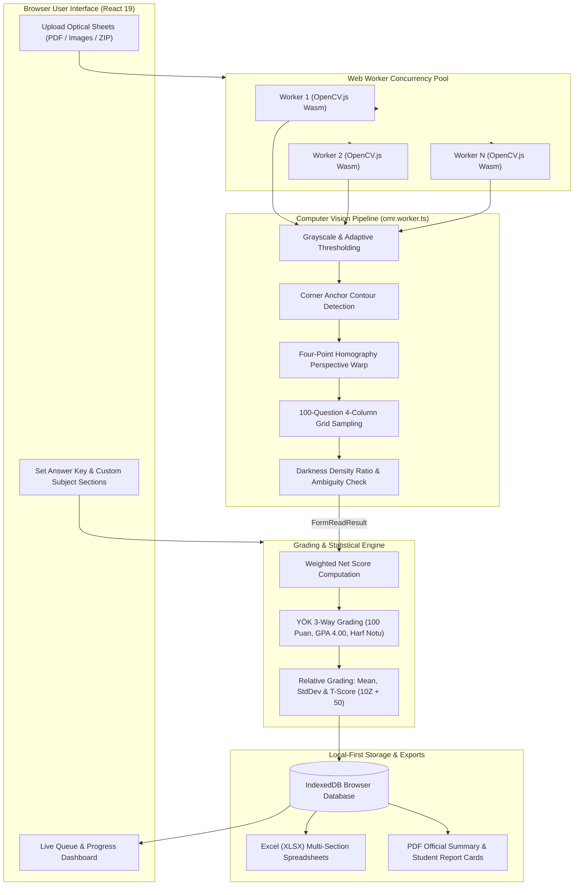

<div align="center">

# 📑 Optical Form Reader — İstemci Taraflı OMR & Akademik Notlandırma Sistemi

</div>

---

<div align="center">

[](#english-version)
&nbsp;&nbsp;&nbsp;&nbsp;
[](#turkish-version)

</div>

---

<div align="center">


</div>

---

<a id="english-version"></a>
# English Version

<div align="center">
  
  <h3>Optical Form Reader — High-Performance Browser-Based OMR & Grading Engine</h3>
  <p><em>100% Client-Side, Privacy-First, Zero-Server Optical Mark Recognition Suite with Turkish Higher Education (YÖK) 3-Tier Grading & Bell Curve (T-Score) Integration</em></p>
  <p><strong>Developed & Maintained by <a href="https://github.com/emirtdede">emirtdede</a> &bull; Powered by <a href="https://vellium.dev">Vellium</a></strong></p>
</div>

<br>

## 💻 Project Overview

**Optical Form Reader** (Optik Form Okuyucu) is an enterprise-grade, privacy-first web application engineered with **React 19**, **TypeScript 5.7**, **Vite 7.3**, and **OpenCV.js (WebAssembly)**. It enables teachers, educational institutions, universities, and exam proctors to scan, evaluate, grade, and analyze standardized 100-question optical answer sheets entirely within the user's browser.

Traditional optical grading systems require expensive dedicated hardware scanners, per-scan software licenses, or cloud uploads that expose sensitive student data. **Optical Form Reader** completely eliminates these drawbacks through a **Local-First, Zero-Server Architecture**:
1. Optical sheets (PDF, PNG, JPG, ZIP bundles) are processed locally inside **Web Worker pools** using **OpenCV.js computer vision**.
2. **Zero Student Data Leaves the Device**: All data, images, answer matrices, and diagnostic metrics remain isolated in the browser's **IndexedDB**, guaranteeing 100% compliance with strict privacy regulations (GDPR & KVKK).
3. The platform features an academic-grade grading engine supporting **custom subject partitioning (e.g., 4 sections)**, **optional question weight matrices**, **3-tier scoring (100-Point Score, 4.00 GPA, YÖK Letter Grade)**, and **Relative Grading / Bell Curve (T-Score BDS)**.

---

## 🚀 Key Features

- **100% Client-Side Computer Vision Engine**:
  - **Perspective Correction & Alignment**: Four corner anchor-point contour detection with homography transformation for skewed, tilted, or rotated photos.
  - **Dynamic Fill-Thresholding & Confidence Analysis**: Adaptive Otsu thresholding, darkness density ratio calculation, ambiguous bubble detection, and dual-mark warnings.
  - **Multi-Core Web Worker Pool**: Parallel non-blocking image processing across all CPU cores with batch progress tracking and interrupt-resilient session recovery.
- **Custom Section & Multi-Subject Partitioning**:
  - Automatically partitions 100-question forms into 4 customizable sections (e.g., *1–25, 26–50, 51–75, 76–100*).
  - Users can customize subject names (*e.g., Math, Science, Language*), modify question ranges, add new sections, or reset to defaults with one click.
- **Advanced Optional Question Weighting (Katsayı Matrisi)**:
  - Collapsible, distraction-free configuration panel.
  - Apply section-wide multipliers or fine-tune individual weights for each of the 100 questions.
- **Turkish Higher Education (YÖK) 3-Tier Grading**:
  - **100-Point Normalized Score**: Scaled net performance score based on penalty rules (e.g., 4 wrong answers cancel 1 correct).
  - **4.00 GPA Scale**: Standard conversion table for university grade-point averages.
  - **Absolute Letter Grades**: `AA` (4.00), `BA` (3.50), `BB` (3.00), `CB` (2.50), `CC` (2.00), `DC` (1.50), `DD` (1.00), `FD` (0.50), `FF` (0.00).
- **Relative Grading System / Bell Curve (Çan Eğrisi BDS)**:
  - Dynamic toggle calculating Class Arithmetic Mean ($\bar{X}$), Standard Deviation ($S$), $Z$-Scores, and $T$-Scores ($T = 10Z + 50$).
  - Automatic assignment of relative letter grades based on class curve with raw-score threshold protections.
- **Interactive Student Review Drawer**:
  - Slide-out drawer displaying 3-tier grades, subject breakdown table, and 100-question interactive answer grid.
  - Manual score overrides, student ID editing, and instant recalculation saved directly to IndexedDB.
- **Comprehensive Reporting & Multi-Format Exporters**:
  - **Excel (XLSX) & CSV**: Full class spreadsheets with dynamic per-section columns (`D`, `Y`, `B`, `Net`) + 3-way grades + T-scores.
  - **PDF Student Report Cards**: Ready-to-print single-page student certificates with subject breakdown tables and 100-question visual answer matrices.
  - **Class-Wide Summary PDF, JSON Manifests, and ZIP Archives**: Complete batch export options.
- **Zero Telemetry & Offline-First**:
  - Fully offline operational capability, zero external trackers, zero ads, zero telemetry, and 1-click local database purge in Settings.

---

## 🛠️ Tech Stack

<div align="center">


</div>

### Core & Computer Vision
- **OpenCV.js (WebAssembly)**: High-performance image processing, contour filtering, adaptive thresholding, and perspective warp.
- **Dedicated Web Workers (`omr.worker.ts`)**: Background multithreading ensuring the user interface never freezes during large 500+ sheet processing runs.
- **PDF.js (`pdfjs-dist`)**: Client-side multi-page PDF rasterization into high-resolution canvas frames.

### Frontend & Reactive UI
- **React 19 & TypeScript 5.7**: Modern functional components, hooks, lazy loading (`React.lazy`), and type-safe architecture.
- **React Router 7**: SPA routing with deep linking, state preservation, and dynamic parameter resolution.
- **Lucide React**: Clean, accessible SVG iconography.
- **Vanilla CSS Design System**: Zero-framework design tokens, HSL palette, dark/light themes, glassmorphism, and responsive CSS grid.

### Storage & Export Engines
- **IndexedDB**: Persistent local browser database for sessions, batches, diagnostic metrics, and student results.
- **ExcelJS & JSZip**: Styled multi-column spreadsheet generation and compressed bundle archiving.
- **jsPDF & jsPDF-AutoTable**: Vector PDF generation for official exam summaries and individual student report cards.

---

## 📁 Project Structure

```tree
Optical-Form-Reader/
├── public/                         # Static assets, logos, and web manifest
│   ├── Optik_Form.pdf              # Standard printable 100-question sample sheet
│   ├── product-logo.svg            # Vector product mark
│   ├── robots.txt                  # Search engine and AI crawler directives
│   ├── sitemap.xml                 # Canonical XML sitemap
│   └── manifest.webmanifest        # PWA manifest
├── src/                            # Application source code (React 19 + TS)
│   ├── components/                 # Reusable UI component library
│   │   ├── AppShell.tsx            # Sticky header, navigation, and theme wrapper
│   │   ├── Brand.tsx               # Brand marks and typography
│   │   ├── Footer.tsx              # Footer ribbon, links, and copyright
│   │   └── SectionConfigPanel.tsx  # Section manager, range editor, and weight matrix
│   ├── context/                    # React Context providers
│   │   └── AppDataContext.tsx      # Global state for active sessions, storage & theme
│   ├── domain/                     # Pure business logic and academic domain
│   │   ├── e2e-workflow.test.ts    # End-to-end integration lifecycle test suite
│   │   ├── files.ts / .test.ts     # File validation, MIME detection, and ZIP extraction
│   │   ├── grading.ts / .test.ts   # YÖK 3-tier scales, section scoring & T-Score bell curve
│   │   ├── processing.ts / .test.ts# Batch queue management and worker pool dispatcher
│   │   ├── scoring.ts / .test.ts   # Weighted answer comparison and recalculation engine
│   │   └── statistics.ts / .test.ts# Class summary statistics & question difficulty analysis
│   ├── export/                     # Multi-format report generators
│   │   └── exporters.ts            # Excel (XLSX), CSV, JSON, ZIP, Print, and PDF cards
│   ├── hooks/                      # Custom React hooks
│   │   ├── useTheme.ts             # Dark/Light theme toggle & system preference sync
│   │   └── useWorkerPool.ts        # Dynamic Web Worker lifecycle and task distributor
│   ├── omr/                        # OMR Engine & Web Worker pipeline
│   │   ├── omr.worker.ts           # OpenCV.js computer vision OMR processor
│   │   └── workerClient.ts         # Worker pool communication bridge
│   ├── pages/                      # Application route views (Code-split with React.lazy)
│   │   ├── GuidePage.tsx           # Visual guide on sheet printing & camera scanning
│   │   ├── HomePage.tsx            # Hero presentation & live scan simulation animation
│   │   ├── LegalPage.tsx           # Privacy, KVKK, Terms, Storage & Cookie policies
│   │   ├── NotFoundPage.tsx        # Accessible 404 error page
│   │   ├── ResultsPage.tsx         # Results table, Bell curve toggle & student review drawer
│   │   ├── ScannerPage.tsx         # Multi-file dropzone, answer key setter & section config
│   │   └── SettingsPage.tsx        # Storage usage gauge, partition settings & data reset
│   ├── storage/                    # Local storage engine
│   │   ├── database.ts             # IndexedDB schema, migrations & CRUD operations
│   │   └── database.test.ts        # Database integrity test suite
│   ├── App.tsx                     # Top-level routing, error boundary & Suspense fallback
│   ├── constants.ts                # App constants, defaults, and question thresholds
│   ├── main.tsx                    # React application entry point
│   ├── styles.css                  # Master CSS design system and theme variables
│   └── types.ts                    # Global TypeScript interfaces and domain types
├── package.json                    # Node dependencies and project scripts
├── tsconfig.json                   # TypeScript compiler configuration
├── vite.config.ts                  # Vite bundler, chunking & test configuration
└── README.md                       # Master Documentation
```

---

## 📊 Architecture & OMR Processing Pipeline



### Data Storage & Grading Specifications

| Feature | Technical Implementation | Description |
| :--- | :--- | :--- |
| **OMR Vision Engine** | **OpenCV.js (WebAssembly)** | 4-point homography warp, contour detection & density ratio thresholding |
| **Concurrency** | **Web Workers (1–4 Threads)** | Non-blocking multi-core background image processing |
| **Local Database** | **IndexedDB (`omr_database_v2`)** | Persistent local session store, student results, and diagnostic logs |
| **Absolute Grading** | **YÖK Standard Scale** | 100-point normalized score $\rightarrow$ GPA 4.00 $\rightarrow$ `AA` through `FF` |
| **Relative Grading** | **T-Score Normal Distribution** | $Z = \frac{X - \bar{X}}{S}$, $T = 10Z + 50$ with threshold protection |
| **Export Formats** | **ExcelJS, jsPDF, JSZip** | XLSX with dynamic section headers, vector PDF report cards & ZIP archives |

---

## ⚙️ Installation & Usage

### Prerequisites
- **Node.js**: Version 18.0.0 or higher
- **npm**: Version 9.0.0 or higher
- **Modern Browser**: Chrome, Edge, Firefox, Safari (HTML5 Canvas & WebAssembly support required)

### Step-by-Step Developer Setup

1. **Clone the Repository:**
   ```bash
   git clone https://github.com/emirtdede/Optical-Form-Reader.git
   cd Optical-Form-Reader
   ```

2. **Install Node Dependencies:**
   ```bash
   npm install
   ```

3. **Run Automated Test Suites:**
   ```bash
   npm test
   ```

4. **Start Local Development Server:**
   ```bash
   npm run dev
   ```
   Open [http://localhost:8081](http://localhost:8081) in your browser.

5. **Build Production Bundle:**
   ```bash
   npm run build
   ```
   The production-ready artifacts will be compiled into the `dist/` directory.

---

## ⚖️ License

Distributed under the **MIT License**. See [`LICENSE`](LICENSE) for more information.

**Author**: [emirtdede](https://github.com/emirtdede) &bull; **Powered by**: [Vellium](https://vellium.dev)

---

<br>

---

<a id="turkish-version"></a>
# Türkçe Versiyon

<div align="center">
  
  <h3>Optik Form Okuyucu — Yüksek Performanslı Tarayıcı Tabanlı OMR ve Notlandırma Sistemi</h3>
  <p><em>Öğrenci Verilerini Cihazdan Çıkarmayan, %100 İstemci Taraflı, YÖK 3'lü Not Baremi ve Çan Eğrisi (T-Skor) Destekli Optik Değerlendirme Çözümü</em></p>
  <p><strong>Geliştirici: <a href="https://github.com/emirtdede">emirtdede</a> &bull; Destekleyen: <a href="https://vellium.dev">Vellium</a></strong></p>
</div>

<br>

## 💻 Project Overview (Proje Genel Bakışı)

**Optik Form Okuyucu**, **React 19**, **TypeScript 5.7**, **Vite 7.3** ve **OpenCV.js (WebAssembly)** teknolojileri üzerine inşa edilmiş kurumsal düzeyde bir optik form okuma ve sınav değerlendirme web uygulamasıdır. Öğretmenlerin, okulların, üniversitelerin ve sınav uygulayıcılarının 100 soruluk optik cevap kağıtlarını doğrudan web tarayıcısı üzerinden, harici hiçbir sunucuya ihtiyaç duymadan saniyeler içinde okutmasını, notlandırmasını ve analiz etmesini sağlar.

Geleneksel optik okuyucular pahalı donanım cihazları, form başına lisans ücretleri ve öğrenci verilerini buluta aktaran gizlilik riskleri barındırır. **Optik Form Okuyucu**, bu problemleri **%100 Yerel ve İstemci Taraflı (Local-First) Mimari** ile çözer:
1. Yüklenen optik formlar (PDF, PNG, JPG veya ZIP arşivleri) doğrudan tarayıcının içindeki **Web Worker işlem havuzlarında**, **OpenCV.js görüntü işleme algoritmalarıyla** işlenir.
2. **Sıfır Sunucu & Sıfır Veri Sızıntısı**: Öğrenci numaraları, cevaplar ve sınav sonuçları asla internete aktarılmaz; yalnızca kullanıcının cihazındaki **IndexedDB** veritabanında saklanır (KVKK ve GDPR tam uyumlu).
3. **Esnek Bölümlendirme ve YÖK Akademik Notlandırma**: Formu 4 ayrı derse bölme, soru bazlı katsayı atama, 100'lük puan, 4.00 GPA, harf notu ve **T-Skor Bağıl Değerlendirme (Çan Eğrisi)** motoruyla tek çıktıda resmi sınav sonuçları üretir.

---

## 🚀 Key Features (Önemli Özellikler)

- **%100 İstemci Taraflı Görüntü İşleme (OMR Engine)**:
  - **Açı Düzeltme & Perspektif Dönüşümü**: Form köşelerindeki kılavuz işaretlerini (anchor points) kontur analiziyle bularak yamuk, açılı veya dönmüş fotoğrafları 4 noktalı homografi ile milimetrik olarak düzleştirir.
  - **Dinamik Doluluk Eşiği & Belirsizlik Tespiti**: Adaptif Otsu eşikleme, baloncuk doluluk oranı analizi, çift işaretleme ve belirsiz işaretleme uyarıları.
  - **Çok Çekirdekli Web Worker Havuzu**: Çoklu çekirdek desteğiyle arayüzü dondurmadan yüzlerce kağıdı arka planda eşzamanlı işleme.
- **Esnek Bölüm & Çoklu Ders Yapılandırması**:
  - 100 soruluk form varsayılan olarak **4 eşit parçaya (1–25, 26–50, 51–75, 76–100)** bölünür.
  - Kullanıcı bölümlere dilediği ders adını (*Türkçe, Matematik, Fen vb.*) yazabilir, soru aralıklarını esnekçe değiştirebilir, yeni bölüm ekleyebilir veya tek tıkla varsayılana sıfırlayabilir.
- **Gelişmiş ve Gizlenebilir Soru Katsayı Matrisi**:
  - Arayüzü yormamak için açılır/kapanır (collapsible) gelişmiş seçenekler paneli.
  - İster bölüme toplu katsayı çarpanı (örn. 2.0x), ister 100 sorunun her birine tek tek özel puan ağırlığı girilebilir.
- **Türkiye YÖK Uyumlu 3'lü Notlandırma Baremi**:
  - **100 Üzerinden Puan (%0 – %100)**: Net ve katsayılara göre normalize edilmiş başarı notu.
  - **4.00 GPA Notu**: Üniversite transkriptleri için 4'lük sistem dönüşümü.
  - **Resmi YÖK Harf Notu**: `AA` (4.00), `BA` (3.50), `BB` (3.00), `CB` (2.50), `CC` (2.00), `DC` (1.50), `DD` (1.00), `FD` (0.50), `FF` (0.00).
- **Çan Eğrisi (YÖK Bağıl Değerlendirme Sistemi & T-Skoru)**:
  - Sonuç ekranında anlık açılıp kapatılabilen Çan Eğrisi butonu.
  - Sınıfın Aritmetik Ortalaması ($\bar{X}$) ve Standart Sapması ($S$) hesaplanarak $Z = \frac{X - \bar{X}}{S}$ ve $T = 10Z + 50$ formülüyle her öğrenciye bağıl harf notu atanır.
- **İnteraktif Öğrenci İnceleme Çekmecesi (Drawer)**:
  - Sağdan açılan çekmecede 3'lü not kartları, ders bazlı net kırılım tablosu ve 100 soruluk cevap matrisi.
  - Öğrenci numarası düzeltme, cevap şıkkını elle güncelleme ve anında yeniden hesaplama desteği.
- **Zengin Raporlama & Çoklu Format Dışa Aktarımı**:
  - **Excel (XLSX) & CSV**: Her bölüm için ayrı ayrı *D, Y, B, Net* sütunları, 3'lü notlar ve Çan Harfi (T-Skor).
  - **PDF Öğrenci Karnesi**: Öğrencinin eline verilecek resmi karne çıktısında ders ders başarı tablosu ve 100 soru detay matrisi.
  - **Toplu Sınav PDF Raporu, JSON Manifestosu ve ZIP Paketleri**.
- **Sıfır Telemetri ve Tam Çevrimdışı Çalışma**:
  - Sıfır dış ağ isteği, sıfır çerez, sıfır takip ve Ayarlar sayfasından tek tıkla yerel veritabanını temizleme imkanı.

---

## 🛠️ Tech Stack (Teknoloji Yığını)

<div align="center">


</div>

### Çekirdek ve Görüntü İşleme (Computer Vision)
- **OpenCV.js (WebAssembly)**: İstemci taraflı kontur tespiti, adaptif eşikleme ve 4 noktalı perspektif dönüşümü.
- **Web Worker İşlem Havuzu (`omr.worker.ts`)**: Çoklu iş parçacığı (multithreading) ile arka planda kesintisiz form işleme.
- **PDF.js (`pdfjs-dist`)**: Çok sayfalı PDF sınav kağıtlarını doğrudan tarayıcıda yüksek çözünürlüklü görsellere dönüştürme.

### Ön Yüz ve Kullanıcı Arayüzü (React & TypeScript)
- **React 19 & TypeScript 5.7**: Bileşen mimarisi, React.lazy ile sayfa bazlı kod bölme (code-splitting) ve tip güvenliği.
- **React Router 7**: SPA yönlendirme, derin linkleme ve durum koruması.
- **Lucide React**: Modern, tutarlı ve erişilebilir SVG ikon kütüphanesi.
- **Özel CSS Tasarım Sistemi**: CSS Değişkenleri, HSL renk paleti, karanlık/aydınlık tema ve tam duyarlı mobil grid.

### Yerel Depolama ve Raporlama Motoru
- **IndexedDB**: Sınav oturumları, taranan cevaplar ve performans teşhis logları için kalıcı yerel tarayıcı veritabanı.
- **ExcelJS & JSZip**: Çok sütunlu biçimlendirilmiş Excel çalışma kitapları ve toplu ZIP arşivleri üretimi.
- **jsPDF & jsPDF-AutoTable**: Resmi sınav listeleri ve tek sayfalık öğrenci karneleri için vektörel PDF çıktısı.

---

## 📁 Project Structure (Proje Klasör Yapısı)

```tree
Optical-Form-Reader/
├── public/                         # Statik dosyalar, logolar ve manifest
│   ├── Optik_Form.pdf              # Standart basılabilir 100 soruluk örnek form
│   ├── product-logo.svg            # Vektörel ürün logosu
│   ├── robots.txt                  # Arama motoru ve yapay zeka bot direktifleri
│   ├── sitemap.xml                 # Kanonik XML site haritası
│   └── manifest.webmanifest        # PWA web manifestosu
├── src/                            # Uygulama kaynak kodları (React 19 + TS)
│   ├── components/                 # Yeniden kullanılabilir UI bileşenleri
│   │   ├── AppShell.tsx            # Üst navigasyon barı, tema seçici ve layout
│   │   ├── Brand.tsx               # Vektörel marka ve logo bileşenleri
│   │   ├── Footer.tsx              # Alt bilgi, yasal linkler ve telif şeridi
│   │   └── SectionConfigPanel.tsx  # Bölüm yapılandırma, aralık seçici ve katsayı matrisi
│   ├── context/                    # React Context durum sağlayıcıları
│   │   └── AppDataContext.tsx      # Aktif oturumlar, depolama ve tema global state'i
│   ├── domain/                     # Saf iş kuralları ve akademik değerlendirme motoru
│   │   ├── e2e-workflow.test.ts    # Uçtan uca kullanıcı akışı entegrasyon testleri
│   │   ├── files.ts / .test.ts     # Dosya doğrulama, MIME kontrolü ve ZIP açma
│   │   ├── grading.ts / .test.ts   # YÖK baremleri, bölüm notlandırma ve Çan Eğrisi T-Skoru
│   │   ├── processing.ts / .test.ts# Kuyruk yönetimi ve Web Worker iş dağıtıcısı
│   │   ├── scoring.ts / .test.ts   # Ağırlıklı net hesaplama ve cevap karşılaştırma
│   │   └── statistics.ts / .test.ts# Sınıf istatistikleri ve soru güçlük analizi
│   ├── export/                     # Çoklu format dışa aktarma modülleri
│   │   └── exporters.ts            # Excel (XLSX), CSV, JSON, ZIP, Yazdırma ve PDF Karne
│   ├── hooks/                      # Özel React hook'ları
│   │   ├── useTheme.ts             # Açık/Koyu tema yönetimi ve sistem tercihi
│   │   └── useWorkerPool.ts        # Web Worker yaşam döngüsü ve görev yöneticisi
│   ├── omr/                        # OMR Görüntü İşleme & Web Worker Çekirdeği
│   │   ├── omr.worker.ts           # OpenCV.js OMR algoritması
│   │   └── workerClient.ts         # Worker iletişim köprüsü
│   ├── pages/                      # Sayfa görünümleri (React.lazy ile kod bölümlü)
│   │   ├── GuidePage.tsx           # Form baskı ve optik tarama rehberi
│   │   ├── HomePage.tsx            # Karşılama sayfası ve canlı tarama animasyonu
│   │   ├── LegalPage.tsx           # Gizlilik, KVKK, Kullanım Koşulları ve Çerez sayfaları
│   │   ├── NotFoundPage.tsx        # 404 Sayfa bulunamadı ekranı
│   │   ├── ResultsPage.tsx         # Sonuç tablosu, Çan Eğrisi ve öğrenci inceleme çekmecesi
│   │   ├── ScannerPage.tsx         # Dosya yükleme alanı, cevap anahtarı ve bölüm paneli
│   │   └── SettingsPage.tsx        # Depolama göstergesi, işlem ayarları ve veri sıfırlama
│   ├── storage/                    # Yerel veritabanı motoru
│   │   ├── database.ts             # IndexedDB şeması, CRUD işlemleri ve sürüm yönetimi
│   │   └── database.test.ts        # Veritabanı doğrulama testleri
│   ├── App.tsx                     # Kök yönlendirme, hata yakalama (Error Boundary) ve Suspense
│   ├── constants.ts                # Uygulama sabitleri ve eşik değerleri
│   ├── main.tsx                    # React DOM başlatma noktası
│   ├── styles.css                  # Ana CSS tasarım sistemi ve tema değişkenleri
│   └── types.ts                    # Global TypeScript tip ve arayüz tanımları
├── package.json                    # Bağımlılıklar ve npm scriptleri
├── tsconfig.json                   # TypeScript derleyici yapılandırması
├── vite.config.ts                  # Vite derleyici ve test yapılandırması
└── README.md                       # Ana Dokümantasyon
```

---

## 💾 Storage & Grading Schema (Kasa Şeması ve Puanlama Yapısı)

| Özellik / Katman | Standart / Mimari | Açıklama |
| :--- | :--- | :--- |
| **OMR Algoritması** | **OpenCV.js (WebAssembly)** | 4 noktalı köşe tespiti, perspektif düzeltme ve baloncuk yoğunluk oranı |
| **İşlem Paralelliği** | **Web Workers (1–4 İş Parçacığı)** | Arayüzü dondurmayan çok çekirdekli arka plan tarama motoru |
| **Yerel Veritabanı** | **IndexedDB (`omr_database_v2`)** | Oturumlar, öğrenci cevapları ve okuma kalitesi teşhis logları |
| **Mutlak Notlandırma** | **YÖK 3'lü Barem** | 100 üzerinden not $\rightarrow$ 4.00 GPA $\rightarrow$ `AA` ile `FF` arası Harf Notu |
| **Bağıl Değerlendirme** | **T-Skor Çan Eğrisi** | $Z = \frac{X - \bar{X}}{S}$, $T = 10Z + 50$ (Sınıf ortalaması ve standart sapma) |
| **Rapor Çıktıları** | **ExcelJS, jsPDF, JSZip** | Ders bazlı sütunlu Excel (XLSX), PDF karneler ve ZIP arşivleri |

---

## ⚙️ Installation & Usage (Kurulum ve Kullanım)

### Gereksinimler
- **Node.js**: Sürüm 18.0.0 veya üzeri
- **npm**: Sürüm 9.0.0 veya üzeri
- **Modern Web Tarayıcısı**: Chrome, Edge, Firefox veya Safari (HTML5 Canvas & WebAssembly desteği)

### Adım Adım Geliştirici Kurulumu

1. **Depoyu Klonlayın:**
   ```bash
   git clone https://github.com/emirtdede/Optical-Form-Reader.git
   cd Optical-Form-Reader
   ```

2. **Node Bağımlılıklarını Yükleyin:**
   ```bash
   npm install
   ```

3. **Otomatik Testleri Çalıştırın:**
   ```bash
   npm test
   ```

4. **Yerel Geliştirme Sunucusunu Başlatın:**
   ```bash
   npm run dev
   ```
   Tarayıcınızda [http://localhost:8081](http://localhost:8081) adresini açın.

5. **Production Paketini Derleyin:**
   ```bash
   npm run build
   ```
   Canlı yayına hazır optimize dosyalar `dist/` klasörüne derlenecektir.

---

## ⚖️ License (Lisans)

Bu proje **MIT Lisansı** ile lisanslanmıştır. Detaylar için [`LICENSE`](LICENSE) dosyasına başvurabilirsiniz.

**Geliştirici**: [emirtdede](https://github.com/emirtdede) &bull; **Destekleyen**: [Vellium](https://vellium.dev)
