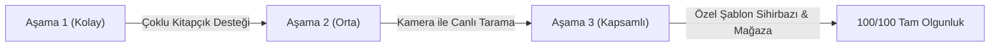

# 🎯 Gelecek Hedefleri ve Ürün Yol Haritası (Product Roadmap)

**Ürün:** Optik Form Okuyucu  
**Geliştirici & Yayıncı:** Vellium  
**Kapsam:** Gelecek Sürümler İçin Planlanan Hedefler  
**Tarih:** Eylül 2026  

---

## 🚀 Planlanan 3 Ana Gelecek Özelliği (Öncelik Sırasıyla)

Sistemi dünya standartlarında bir ürüne ulaştıracak ve kurumsal sınav uyumluluğunu en üst düzeye çıkaracak gelecek hedefleri:

---

### 🟢 Aşama 1: Çoklu Kitapçık Desteği (A / B / C / D Kitapçıkları)
* **Zorluk Seviyesi:** **Kolay (Tahmini Efor: 1 – 2 Saat)**
* **Öncelik:** **Yüksek (P0)**
* **Planlanan Sürüm:** **v2.2.0**

#### Hedef & Kapsam:
Sınavlarda kopya önleme amacıyla kullanılan farklı soru sıralamasına sahip kitapçık türlerinin tek oturumda otomatik okunabilmesi.

#### Teknik Uygulama Planı:
1. **OMR Kitapçık Algılama:** Formun üst bilgi alanındaki `[A] [B] [C] [D]` baloncuklarının `omr.worker.ts` tarafından taranması.
2. **Çoklu Cevap Anahtarı Girişi:** Sınav kurulum ekranında her kitapçık türü için ayrı sekme veya A kitapçığını referans alıp diğer kitapçıklar için soru eşleme matrisi (*Örn: B Kitapçığı S1 = A Kitapçığı S15*) tanımlama.
3. **Puanlama Entegrasyonu:** `scoring.ts` içindeki `compareWithAnswerKey` fonksiyonunun öğrencinin kodladığı kitapçık türünü baz alarak doğru anahtarla eşleştirilmesi.

---

### 🟡 Aşama 2: Kamera ile Canlı / Anlık Tarama (Webcam & Telefon Kamerası)
* **Zorluk Seviyesi:** **Orta (Tahmini Efor: 3 – 5 Saat)**
* **Öncelik:** **Orta (P1)**
* **Planlanan Sürüm:** **v2.3.0**

#### Hedef & Kapsam:
Öğretmenlerin kağıtları tek tek tarayıcıdan geçirmek veya fotoğraf yüklemek yerine telefon/bilgisayar kamerasını kağıda tutarak 1 saniyede anlık okutabilmesi.

#### Teknik Uygulama Planı:
1. **Canlı Video Akışı:** Tarayıcının yerel `navigator.mediaDevices.getUserMedia` API'si ile video vizörünün açılması.
2. **Görsel Kılavuz & Vizör:** Ekranda optik form sınırlarını gösteren dinamik bir hizalama çerçevesi.
3. **Akıllı Otomatik Yakalama (Auto-Capture):** OpenCV.js ile saniyede 3–5 kare işlenerek formun 4 köşe siyah kılavuz noktası yüksek güvenilirlikle algılandığında çerçevenin yeşile dönmesi, "Bip" sesi/titreşim eşliğinde fotoğrafın otomatik çekilip sonuç listesine eklenmesi.

---

### 🔴 Aşama 3: Özelleştirilebilir Şablon Sihirbazı & Şablon Mağazası
* **Zorluk Seviyesi:** **Kapsamlı (Tahmini Efor: 1 – 2 Gün)**
* **Öncelik:** **Gelecek Sürüm (P2)**
* **Planlanan Sürüm:** **v3.0.0**

#### Hedef & Kapsam:
Sabit 100 soru haricinde kullanıcıların 15, 20, 30, 40 veya 50 soruluk mini sınavlar, quizler veya denemeler için kendi özel optik formlarını oluşturup indirebilmesi ve indireceği hazır şablonları okutabilmesi.

#### Teknik Uygulama Planı:
1. **Dinamik PDF Üretici (jsPDF):** Seçilen soru sayısı ve şık adedine göre vektörel baskıya hazır standart PDF formu üreten sihirbaz arayüzü.
2. **Merkezi Şablon Şeması (`FormTemplateDefinition`):** Her şablonun köşe koordinatlarını ve baloncuk grid haritasını tutan JSON veri modeli.
3. **QR / Barkodlu Otomatik Şablon Tanıma:** Formun köşesine basılan küçük QR kod ile OMR motorunun formun hangi şablona ait olduğunu kullanıcı seçimi olmadan otomatik algılaması.
4. **Şablon Mağazası (Template Hub):** Kullanıcıların sınav türlerine göre (LGS, YKS, Üniversite Vize/Final, Quiz) hazırlanmış standart şablonları tek tıkla indirebileceği dahili şablon galerisi.

---

## 📊 Gelecek Sürümler Yol Haritası Tablosu

| Hedeflenen Özellik | Zorluk | Öncelik | Hedef Sürüm |
| :--- | :---: | :---: | :---: |
| **Çoklu Kitapçık Desteği (A/B/C/D)** | Kolay | 🔴 Yüksek (P0) | **v2.2.0** |
| **Kamera ile Canlı Vizör & Auto-Capture** | Orta | 🟡 Orta (P1) | **v2.3.0** |
| **Şablon Sihirbazı & Şablon Mağazası** | Kapsamlı | 🔵 Gelecek (P2) | **v3.0.0** |
