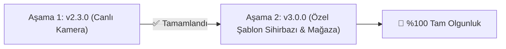

# 🎯 Gelecek Hedefleri ve Ürün Yol Haritası (Product Roadmap)

**Ürün:** Optik Form Okuyucu  
**Geliştirici & Yayıncı:** Vellium  
**Kapsam:** Gelecek Sürümler İçin Planlanan Hedefler  
**Son Güncelleme:** Eylül 2026 (v2.3.0 Sürümü)  

---

## 🚀 Planlanan Gelecek Özelliği

Sistemi dünya standartlarında bir ekosisteme ulaştıracak ve kurumsal sınav uyumluluğunu %100 tam olgunluğa çıkaracak ana hedefimiz:

---

### 🔴 Aşama 1: Özelleştirilebilir Şablon Sihirbazı & Şablon Mağazası
* **Zorluk Seviyesi:** **Kapsamlı (Tahmini Efor: 1 – 2 Gün)**
* **Öncelik:** **Gelecek Ana Sürüm (P1)**
* **Planlanan Sürüm:** **v3.0.0**

#### Hedef & Kapsam:
Sabit 100 soru haricinde kullanıcıların 15, 20, 30, 40 veya 50 soruluk mini sınavlar, quizler veya denemeler için kendi özel optik formlarını oluşturup indirebilmesi ve indireceği hazır şablonları okutabilmesi.

#### Teknik Uygulama Planı:
1. **Dinamik PDF Üretici (jsPDF):** Seçilen soru sayısı ve şık adedine göre vektörel baskıya hazır standart PDF formu üreten sihirbaz arayüzü.
2. **Merkezi Şablon Şeması (`FormTemplateDefinition`):** Her şablonun köşe koordinatlarını ve baloncuk grid haritasını tutan JSON veri modeli.
3. **QR / Barkodlu Otomatik Şablon Tanıma:** Formun köşesine basılan küçük QR kod ile OMR motorunun formun hangi şablona ait olduğunu kullanıcı seçimi olmadan otomatik algılaması.
4. **Şablon Mağazası (Template Hub):** Kullanıcıların sınav türlerine göre (LGS, YKS, Üniversite Vize/Final, Quiz) hazırlanmış standart şablonları tek tıkla indirebileceği dahili şablon galerisi.

---

## 📊 Gelecek Sürümler Yol Haritası Tablosu

| # | Hedeflenen Özellik | Zorluk | Öncelik | Hedef Sürüm |
| :-: | :--- | :---: | :---: | :---: |
| **1** | **Özelleştirilebilir Şablon Sihirbazı & Şablon Mağazası** | Kapsamlı | 🔴 Yüksek (P1) | **v3.0.0** |
